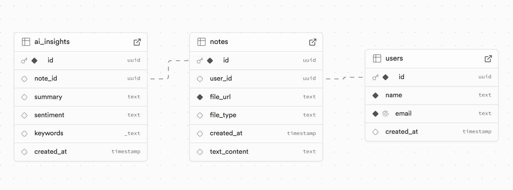

<!-- <h1>🚀 RecallAI – AI-Powered Memory Assistant <h1>
Welcome to RecallAI! This project aims to build an AI-powered memory assistant that helps users log, recall, and act on important information from text, audio, and video files. It integrates FastAPI for backend services, Supabase for database and storage, and Gemini 1.5 Pro for AI-driven insights.

🔥 Why RecallAI?
In today’s fast-paced world, keeping track of conversations, commitments, and tasks is challenging. Traditional note-taking apps require manual input and lack AI-powered memory recall.

🌟 Key Features
✅ AI-Driven Voice & Text Logging – Speak or type notes, and AI extracts key insights.
✅ Context-Aware Smart Reminders – AI understands discussions and sends follow-up reminders.
✅ Quick AI-Powered Memory Recall – Ask: “What did I discuss with Mike last Friday?” and AI finds & summarizes it.
✅ Seamless Integrations – Sync with WhatsApp, Email, Slack, and Google Calendar.

<h2>What You Have Built So Far<h2>
<h3>1. Backend Development (FastAPI)<h3>
You have set up a FastAPI backend to handle:
✅ User Registration – Users can sign up by providing their name and email.
✅ File Uploads – Users can upload text, audio, and video notes.
✅ AI Processing – AI generates insights (summaries) from uploaded notes.

 FastAPI app is working properly, as shown in the API documentation (/docs).

<h3>2. Database & Storage (Supabase)<h3>
✅ User Management – User details (name, email) are stored in the Supabase database.
✅ Note Storage – Notes (text, audio, video) are uploaded to Supabase Storage and linked to users.
✅ AI Insights Storage – AI-generated summaries are stored in a dedicated table.


Your Supabase setup successfully handles file uploads and database operations.

<h3>3. AI Integration (Gemini 1.5 Pro)<h3>
✅ Processing Notes – AI extracts meaningful insights from uploaded notes.
✅ File Handling – You download and process files before sending them to AI.
✅ AI Output Storage – Generated insights are stored for later retrieval.

Your AI processing pipeline is functional and uses Google Gemini 1.5 Pro for content analysis.

<h2>Next Steps & Improvements<h2>
<h3>1. Authentication & Security<h3>
- Implement JWT-based authentication to secure API endpoints.
- Prevent unauthorized access to user notes.

<h3>2. Enhanced AI Features<h3>
- Implement speech-to-text for audio/video notes.
- Add actionable recommendations from AI insights.
- Introduce topic extraction and keyword tagging.

<h3>3. Frontend Development<h3>
- Develop a React.js UI for users to upload and manage notes.
- Display AI-generated summaries in a structured format.

<h3>4. Optimization<h3>
- Improve database schema for efficient querying.
- Implement background tasks for AI processing to avoid blocking API responses.
- Optimize file upload handling for large files.-->
# 🚀 RecallAI – AI-Powered Memory Assistant

Welcome to **RecallAI**! This project aims to build an AI-powered memory assistant that helps users log, recall, and act on important information from text, audio, and video files. It integrates **FastAPI** for backend services, **Supabase** for database and storage, and **Gemini 1.5 Pro** for AI-driven insights.

## 🔥 Why RecallAI?

In today’s fast-paced world, keeping track of conversations, commitments, and tasks is challenging. Traditional note-taking apps require manual input and lack AI-powered memory recall.

### 🌟 Key Features

- ✅ **AI-Driven Voice & Text Logging**: Speak or type notes, and AI extracts key insights.
- ✅ **Context-Aware Smart Reminders**: AI understands discussions and sends follow-up reminders.
- ✅ **Quick AI-Powered Memory Recall**: Ask: "What did I discuss with Mike last Friday?" and AI finds & summarizes it.
- ✅ **Seamless Integrations**: Sync with WhatsApp, Email, Slack, and Google Calendar.

---

## 🛠️ What You Have Built So Far

### 1. Backend Development (FastAPI)

You’ve set up a FastAPI backend to handle:

- ✅ **User Registration**: Users can sign up by providing their name and email.
- ✅ **File Uploads**: Users can upload text, audio, and video notes.
- ✅ **AI Processing**: AI generates insights (summaries) from uploaded notes.

The FastAPI app is working properly, as shown in the [API documentation](https://fastapi.tiangolo.com/#check-it).

---

### 2. Database & Storage (Supabase)

- ✅ **User Management**: User details (name, email) are stored in the Supabase database.
- ✅ **Note Storage**: Notes (text, audio, video) are uploaded to Supabase Storage and linked to users.
- ✅ **AI Insights Storage**: AI-generated summaries are stored in a dedicated table.


Your Supabase setup successfully handles file uploads and database operations.

---

### 3. AI Integration (Gemini 1.5 Pro)

- ✅ **Processing Notes**: AI extracts meaningful insights from uploaded notes.
- ✅ **File Handling**: You download and process files before sending them to AI.
- ✅ **AI Output Storage**: Generated insights are stored for later retrieval.

Your AI processing pipeline is functional and uses **Google Gemini 1.5 Pro** for content analysis.

---

## 🚀 Next Steps & Improvements

### 1. Authentication & Security
- Implement JWT-based authentication to secure API endpoints.
- Prevent unauthorized access to user notes.

### 2. Enhanced AI Features
- Implement speech-to-text for audio/video notes.
- Add actionable recommendations from AI insights.
- Introduce topic extraction and keyword tagging.

### 3. Frontend Development
- Develop a **React.js** UI for users to upload and manage notes.
- Display AI-generated summaries in a structured format.

### 4. Optimization
- Improve database schema for efficient querying.
- Implement background tasks for AI processing to avoid blocking API responses.
- Optimize file upload handling for large files.

---

## 🤝 Contribute to RecallAI

We would love your contributions! If you are interested in AI, FastAPI, Supabase, or productivity tools, join us in making RecallAI better.

### 📌 How to Contribute:

1. **Fork the Repository**
2. **Clone Your Fork**:
    ```bash
    git clone https://github.com/mohithgowdak/RecallAI.git
    cd RecallAI
    ```
3. **Create a Feature Branch**:
    ```bash
    git checkout -b feature-name
    ```
4. **Make Your Changes & Commit**:
    ```bash
    git add .
    git commit -m "Added [Feature Name]"
    ```
5. **Push Changes & Create a Pull Request**:
    ```bash
    git push origin feature-name
    ```

---

## 📬 Contact & Discussions

- 💬 **Join the Discussion**: [Issues & Ideas – GitHub Issues](https://github.com/mohithgowdak/RecallAI/issues)
- 📧 **Reach Out**: [mohi11052003@gmail.com](mailto:mohi11052003@gmail.com)

Let’s build the future of memory recall with AI! 🚀🔥

